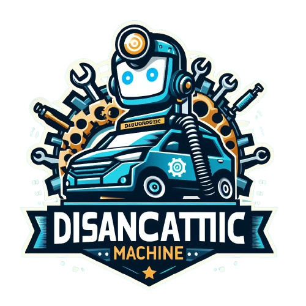

# Diagnóstico de Veículos - DiagnosticMachine



## Descrição

O projeto **Diagnóstico de Veículos** é uma aplicação interativa que permite aos usuários diagnosticar problemas em seus veículos, solicitar orçamentos e acessar informações úteis por meio das abas de **Ajuda** e **Aprenda+**. A aplicação se conecta a uma API em Java para interagir com um banco de dados, garantindo uma experiência fluida e rica em informações.

## Funcionalidades

- **Diagnóstico**: Interaja com o assistente virtual **Carlos** para identificar problemas no seu veículo através de perguntas dinâmicas.
- **Orçamento**: Receba estimativas de custo para os reparos sugeridos.
- **Ajuda**: Acesse informações sobre partes do carro e principais peças.
- **Aprenda+**: Explore conteúdos educativos sobre o mundo automotivo. Com categorias do tipo: Jogos, Vídeos, Artigos
- **Sobre nós**: Conheça um pouco mais sobre o time e veja o repósitorio do projeto e o link do protótipo usado para o desenvolvimento do mesmo.
- **Perfil**: Visualize suas informações cadastradas, podendo atualiza-las, atualizar a foto de perfil para uma experiência mais customizada. Você também pode ver informações do seu veículo, excluir sua conta e fazer logout.
- **Login/Cadastro**: Realize login/cadastro para que você possa desfrutar 100% das funcionalidades, incluindo perfil e ChatBot.

## Tecnologias Utilizadas

- **Frontend**: React.js, TypeScript, Styled-components
- **Backend**: Java (Jersey, gerenciado por Maven)
- **Banco de Dados**: Oracle
- **Ferramentas**: Jira, Trello, Astah, Figma, Canva (para gestão de projetos)

## Instalação

### Pré-requisitos

Antes de começar, certifique-se de que você possui:

- [Node.js](https://nodejs.org/) instalado
- [Projeto API JAVA] instalado

### Passo a Passo

1. **Clone o repositório**:

   ```bash
   git clone https://github.com/seu-usuario/nome-do-repositorio.git
   cd nome-do-repositorio

2. **Instale as dependências do frontend:**:

    npm install

3. **Configuração do Backend**:

   - **Baixe o projeto Java**: Faça o download do arquivo ZIP do projeto Java.
   - **Extraia o arquivo ZIP**: Descompacte o arquivo ZIP em uma pasta de sua escolha.
   - **Abra o arquivo `Main.java`**:
     - Navegue até `src/main/java/org.example/Main.java`.
   - **Execute o projeto**:
     - Clique com o botão direito em `Main.java` e selecione **Run 'Main.main()'** (ou o equivalente em seu IDE) para iniciar o servidor.
   - O servidor estará disponível em `http://localhost:8080/`.

4. **Inicie o servidor front-end**:

    npm run dev

5. **Acesse a aplicação**: 

    Abra seu navegador e acesse http://localhost:3000.


## Estrutura do Projeto

├── frontend                  # Código do frontend
    ├── src                   # Código-fonte da aplicação Next.JS
    ├── README.md             # Este arquivo       
    └── package.json          # Dependências do frontend

## Contribuição

    RM: 558832 - Maria Eduarda Alves da Paixão
    RM: 555181 - Luis Carlos Moreira Duarte
    RM: 555136 - Larissa de Freitas

## Contato

    Se você tiver alguma dúvida ou sugestão, sinta-se à vontade para entrar em contato:
    - Nome: Maria Eduarda
    - E-mail: mariapaixao0807@gmail.com
    Acesse o site: https://diagnostic-machine.vercel.app/